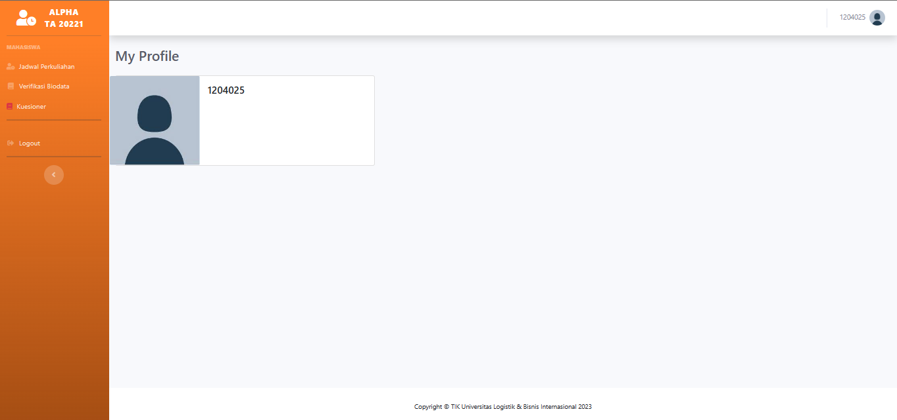
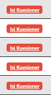

{width="8.496666666666666in"
height="10.999995625546807in"}

1

## DAFTAR ISI

[DAFTAR ISI 2](#daftar-isi)

[DAFTAR GAMBAR 3](#daftar-gambar)

[Bagian 1 Halaman Login 4](#bagian-1-halaman-login)

1.  
2.  

[Halaman Login 4](#halaman-login)[Halaman Dashboard
5](#halaman-dashboard)[Bagian 2 Pengisian Kuesioner
7](#bagian-2-pengisian-kuesioner)

[2.1 Halaman Kuesioner 7](#halaman-kuesioner)

## DAFTAR GAMBAR

> [Gambar 1 Tampilan Login 4](#_bookmark4)
>
> [Gambar 2 Token Akses Login 5](#halaman-dashboard)
>
> [Gambar 3 Dashboard 5](#_bookmark7)
>
> [Gambar 4 List Matkuliah Yang Kuesioner 6](#_bookmark8)
>
> [Gambar 5 Status \"Sudah Mengisi\" 6](#_bookmark9)
>
> [Gambar 6 Status \"Isi Kuesioner\" 6](#_bookmark10)
>
> [Gambar 7 Tampilan Kuesioner 7](#_bookmark13)
>
> [Gambar 8 Tampilan Pertanyaan dan Penilaian 7](#_bookmark14)
>
> [Gambar 9 Tombol Submit dan Cancel 8](#_bookmark15)

# Bagian 1 Halaman Login

### Halaman Login

1)  Sebelum mengisi kuesioner mahasiswa dapat mengujungi laman
    berikut[[https://alpha.ulbi.ac.id]{.underline},](https://alpha.ulbi.ac.id/)

{width="2.2223042432195976in"
height="3.6380205599300086in"}

> []{#_bookmark4 .anchor}**Gambar 1 Tampilan Login**

2)  Untuk dapat masuk pada halaman login tersebut dapat dilakukan dengan
    3 opsi yaitu sebagai berikut:

    -   pertama mahasiswa dapat melakukan login dengan memasukkan
        > *username* dan *password*

> SIP

-   kedua mahasiswa dapat melakukan login dengan memakai akun google
    yang terdaftar pada SIP

-   ketiga mahasiswa dapat melakukan login dengan cara memindai barkode
    yang telah disediakan, dan kemudian akan diarahkan ke *whatsapp*
    yang mengirim pesan ke iteung berupa token. Setelah mengirimkan
    pesan tersebut anda akan langsung masuk kebagian *dashboard*

> {width="4.15803915135608in"
> height="1.7782283464566928in"}

### Halaman Dashboard

> **Gambar 2 Token Akses Login**

3)  Setelah mahasiswa melakukan login, mahasiswa akan diarahkan pada
    dashboard alpha dimana terdapat sidebar sebelah kiri jadwal
    perkuliahan,verifikasi biodata, kuesioner dan logout. Kemudian
    dipojok kanan dan ditengah terdapat identitas npm mahasiswa masing
    masing.

{width="6.391911636045494in"
height="3.0046872265966753in"}

> []{#_bookmark7 .anchor}**Gambar 3 *Dashboard***

4)  Selanjutnya mahasiswa dapat memilih kuesioner pada *sidebar* sebelah
    kiri dan akan diarahkan pada *list* matakuliah yang belum kuesioner
    sesuai mata kuliah pada semester mahasiswa tersebut. Seperti pada
    gambar dibawah ini, dimana dapat dilihat bahwa terdapat matakuliah
    yang akan diisi kuesionernya.

> {width="6.519376640419948in"
> height="3.0139577865266842in"}
>
> []{#_bookmark8 .anchor}Gambar 4 List Matkuliah Yang Kuesioner

5)  Dapat dilihat bagaimana jika mahasiswa sudah melakukan pengisian
    kuesioner, akan berganti status yaitu "Sudah Mengisi"

{width="3.0174442257217846in"
height="1.5429166666666667in"}

> []{#_bookmark9 .anchor}**Gambar 5 Status \"Sudah Mengisi\"**

6)  Sebaliknya jika mahasiswa belum melakukan proses pengisian kuesioner
    maka pada kolom aksi akan bertuliskan statusnya "Isi Kuesioner"

> {width="1.0740758967629047in"
> height="1.9868744531933509in"}
>
> []{#_bookmark10 .anchor}*Gambar 6 Status \"Isi Kuesioner\"*

# Bagian 2 Pengisian Kuesioner

### 2.1 Halaman Kuesioner

1)  {width="6.1500513998250215in"
    height="3.33625in"}Mahasiswa akan diminta untuk menekan isi
    kuesioner pada bagian sebelumnya, dan mahasiswa akan langsung
    diarahkan pada bagian kuesioner berikut. Terdapat kode mata kuliah,
    nama mata kuliah, kelas , dosen pengampu, beserta pertanyaan --
    pertanyaan yang harus dijawab oleh mahasiswa.

> []{#_bookmark13 .anchor}**Gambar 7 Tampilan Kuesioner**

2)  Pada langkah selanjutnya mahasiswa akan menekan tombol dropdown
    tersebut pada kolom penilaian dan akan diminta untuk memilih dari
    angka 7 -- 1 sesuai dengan kriteria nya masing masing, adapun
    kriterianya sebagai berikut "1 Tidak Sesusai", "3 Cukup Sesuai", "5
    Sesuai" dan "7 Sangat Sesuai"

{width="6.463676727909012in"
height="1.04375in"}

> []{#_bookmark14 .anchor}**Gambar 8 Tampilan Pertanyaan dan Penilaian**

3)  Setelah semua pertanyaan dijawab dan dipilih sesuai kriterianya
    masing -- masing maka mahasiswa dapat mengirim hasilnya dengan
    menekan tombol submit.

{width="2.6635706474190726in"
height="0.95625in"}

> []{#_bookmark15 .anchor}**Gambar 9 Tombol Submit dan Cancel**

Note : Apabila Mahasiswa belum melakukan pengisian kuesioner terhadap
mata kuliah yang diambil, maka nilai setiap mata kuliah pada SIP tidak
bisa dilihat.

Contoh : Jika mahasiswa A tidak mengisi Kuesioner terhadap mata kuliah
yang diampu yaitu "XYZ" Maka mata kuliah "XYZ" tidak akan tampil pada
halaman nilai SIP.

{width="6.888888888888889in"
height="3.466666666666667in"}
