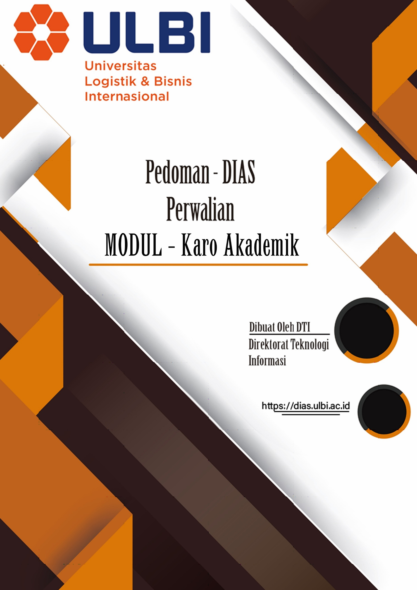
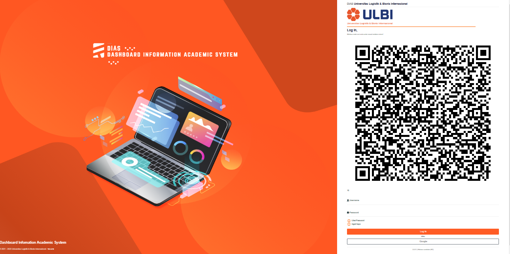
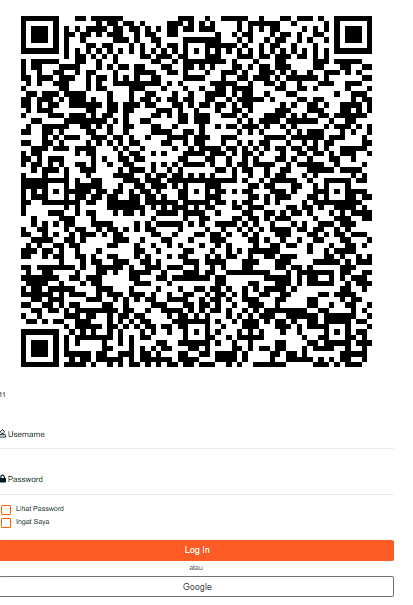
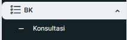
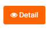
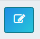
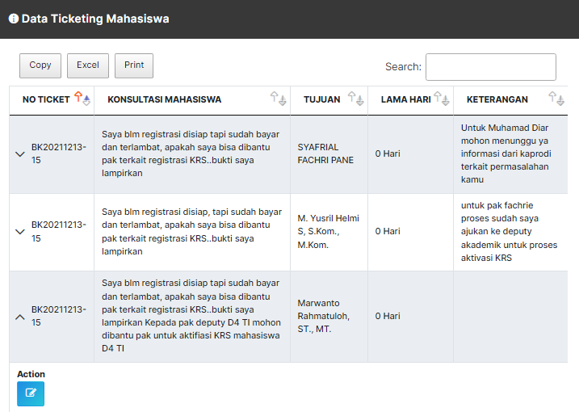
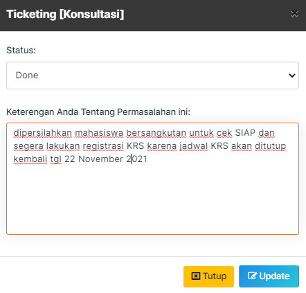
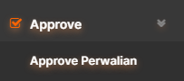
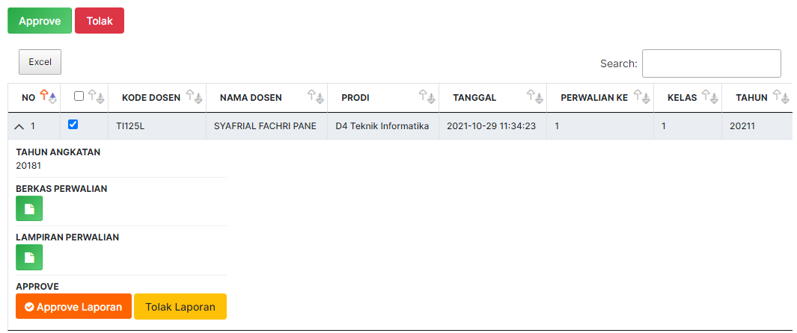

# **DAFTAR ISI** 

- DAFTAR GAMBAR 

- A. Halaman Login

    -  Halaman Login 

- B. Perwalian 

    -  Perwalian Mahasiswa 

    -  Konsultasi 

- C. Approve 

    -  Approve Perwalian 

# **DAFTAR GAMBAR** 

Gambar A.1 Halaman Login Dias 

Gambar B.1 Blok Menu Konsultasi 

Gambar B.2 Data Konsultasi 

Gambar B.3 Data Ticketing Mahasiswa 

Gambar B.4 Halaman Pembahasan 

Gambar C.1 Blok Approve Perwalian 

Gambar C.2 Halaman Approve Perwalian 

# Halaman Login

## Halaman Login

Untuk masuk ke halaman **DIAS** Karo Akademik dapat mengakses ke halaman
utama
```
 https://dias.ulbi.ac.id/
 
 ```

  ---------------------------------------------------------------------------------------------
  
  ---------------------------------------------------------------------------------------------
  Gambar A.1 Halaman Login Dias

  ---------------------------------------------------------------------------------------------

Karo Akademik *login* terlebih dahulu dengan *username* dan *password*
yang telah ditentukan pada blok *login* yang berada disebelah kanan atas
pada halaman utama DIAS.

  ---------------------------------------------------------------------------------------------
  
  ---------------------------------------------------------------------------------------------

  --------------------------------------------------------------------------------------------

Setelah *login* berhasil, maka Karo Akademik akan diarahkan ke halaman
masing-masing untuk melaksanakan aktivitas pada DIAS.

# Perwalian

## Perwalian Mahasiswa

Pada blok **BK** klik menu **Konsultasi.**

  ---------------------------------------------------------------------------------------------
  
  ---------------------------------------------------------------------------------------------
  Gambar B.1 Blok Menu Konsultasi

  ---------------------------------------------------------------------------------------------

## Konsultasi 

> Pada halaman Konsultasi klik *button* *detail* untuk melihat *detail*
> Konsultasi Mahasiswa.
  --------------------------------------------------------------------------------------------
  
  --------------------------------------------------------------------------------------------
  Gambar B.2 Data Konsultasi

  --------------------------------------------------------------------------------------------

> Pada halaman *detail* Konsultasi
> Mahasiswa selanjutnya klik *No* *Ticket* kemudian klik *button*
> *Action*
  ---------------------------------------------------------------------------------------------
  
  ---------------------------------------------------------------------------------------------
  Gambar B.3 Data *Ticketing* Mahasiswa

  ---------------------------------------------------------------------------------------------

> Apabila permasalahan mahasiswa dapat di selesaikan langsung oleh Karo
> Akademik maka pilih Status *Ticketing* *Done* kemudian isi keterangan
> tentang permasalahan ini, jika sudah selesai klik button *update*.
  ---------------------------------------------------------------------------------------------
  
  ---------------------------------------------------------------------------------------------
  Gambar B.4 Halaman Pembahasan

  ---------------------------------------------------------------------------------------------

> Selanjutnya apabila permasalahan mahasiswa tidak bisa diatasi langsung
> oleh Karo Akademik maka Karo Akademik dapat meneruskan pesan mahasiswa
> dengan memilih Status *Ticketing* ke Unit yang bersangkutan mengenai
> permasalahan mahasiswa ini.
# Approvee 

## Approve Perwalian

> Pada blok *Approve* klik *Approve* Perwalian
  -----------------------------------------------------------------------------------------------
  
  -----------------------------------------------------------------------------------------------
  Gambar C.1 Blok Approve Perwalian

  -----------------------------------------------------------------------------------------------

> Pada halaman *Approve* perwalian
> silahkan pilih dosen yang akan di *Approve* selanjutnya pada halaman
> *detail* laporan perwalian Karo Akademik dapat mengecek **Berkas
> perwalian, Lampiran Perwalian** dengan men-klik *button* seperti ini
  ----------------------------------------------------------------------------------------------
  
  ----------------------------------------------------------------------------------------------
 Gambar C.2 Halaman Approve Perwalian

  ----------------------------------------------------------------------------------------------

> Apabila **Berkas perwalian, Lampiran Perwalian** sudah lengkap dan
> sesuai silahkan klik *button* *Approve* Laporan jika tidak lengkap,
> sesuai silahkan klik Tolak Laporan.
