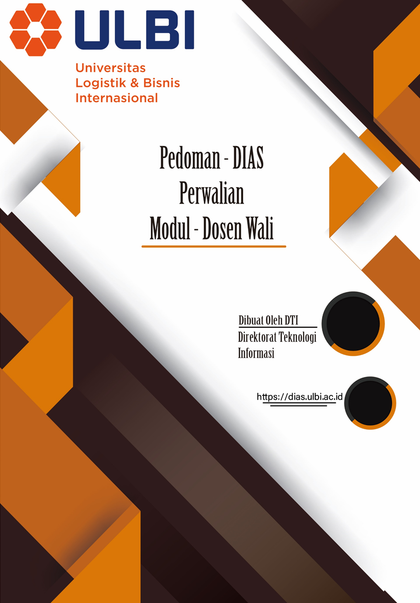

**DAFTAR ISI**

[DAFTAR GAMBAR 3](#daftar-gambar)

[1.](#setting-iteung) Setting Iteung 4

[2.](#halaman-login) Halaman Login 4

> [2.1.](#halaman-login-1) Halaman Login 4

[3.](#menanggapin-konsultasi-mahasiswa-perwalian) Menanggapin Konsultasi
Mahasiswa Perwalian 5

> [3.1.](#perwalian-mahasiswa) Perwalian Mahasiswa 5
>
> [3.2.](#konsultasi-mahasiswa) Konsultasi Mahasiswa 5

[4.](#section-1) Upload Laporan Perwalian 7

> [4.1.](#laporan-perwalian) Laporan Perwalian 7

[5.](#akademik) Akademik 11

> [5.1.](#revisi-akademik) Revisi Akademik 11

# DAFTAR GAMBAR

[Gambar 2.1 Halaman Login DIAS 4](#_heading=h.tyjcwt)

[Gambar 2.2 Halaman Blok Login 5](#_heading=h.3dy6vkm)

[Gambar 3.1 Blok Menu Konsultasi Mahasiswa 5](#_heading=h.2s8eyo1)

[Gambar 3.2 Data Konsultasi Mahasiswa 6](#_heading=h.3rdcrjn)

[Gambar 3.3 Data Ticketing Mahasiswa 6](#_heading=h.26in1rg)

[Gambar 3.4 Halaman Pembahasan 7](#_heading=h.lnxbz9)

[Gambar 4.1 Menu Laporan Perwalian 7](#_heading=h.44sinio)

[Gambar 4.2 Halaman Laporan 8](#_heading=h.2jxsxqh)

[Gambar 4.3 Upload Berkas Perwalian 8](#_heading=h.z337ya)

[Gambar 4.4 Berkas BAP Perwalian di Email oleh Iteung
8](#_heading=h.3j2qqm3)

[Gambar 4.5 Dokumen Lampiran Konsultasi Perwalian
9](#_heading=h.1y810tw)

[Gambar 4.6 Upload Lampiran Perwalian 9](#_heading=h.4i7ojhp)

[Gambar 4.7 Data Lampiran Perwalian 10](#_heading=h.2xcytpi)

[Gambar 4.8 Input Link 10](#_heading=h.2xcytpi)

[Gambar 5.1 Blok Menu Akademik 10](#_heading=h.2bn6wsx)

[Gambar 5.2 Tambah Revisi Akademik 10](#_heading=h.qsh70q)

[Gambar 5.3 Halaman Isi Revisi Akademik 11](#_heading=h.3as4poj)

[Gambar 5.4 Data Revisi Akademik 11](#_heading=h.1pxezwc)

# 

# *Setting* Iteung

1.  Dosen melakukan perwalian di iteung **(Buat WAG anak walian dengan
    > format: PERWALIAN-D4TI-4A-2018).

2.  WAG (Whatsapp Grub) berisi anak walian dan terdapat iteung didalamnya.

3.  Selanjutnya dipersilahkan untuk melakukan perwalian di iteung dengan
    > *keyword*: **iteung perwalian daring mulai**

4.  Jika sudah selesai diskusi perwalian di WAG dipersilahkan ditutup
    dengan *keyword*:

> **iteung perwalian daring selesai catatan \....., \..... km
> {NPM_KM_KELAS}**
>
> Contoh: **iteung perwalian daring selesai catatan Diskusi Daring,
> Matakuliah Mengulang, link google meet ............. km 1184047**

5.  Penutupan bisa berulang ulang dan jangan lupa disampaikan untuk link
    *google meet* pertemuan perwaliannya.

6.  Untuk mengetahui kapan range tanggal/waktu perwalian bisa ke sini:

> **iteung cek tanggal perwalian**

2.  # Halaman Login

    1.  ## Halaman *Login*

> Untuk masuk ke halaman **DIAS** Dosen Wali dapat mengakses ke halaman
> utama
> [**https://dias.ulbi.ac.id/**](https://dias.ulbi.ac.id/)

  ---------------------------------------------------------------------------------------------
  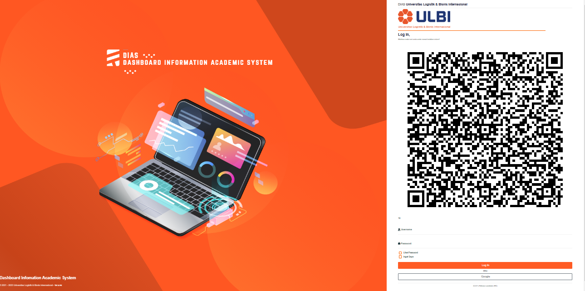
  
  ---------------------------------------------------------------------------------------------
  Gambar 2.1 Halaman Login DIAS

  ---------------------------------------------------------------------------------------------

> Dosen Wali *login* terlebih dahulu dengan *username* dan *password*
> yang telah ditentukan pada blok *login* yang berada disebelah kanan
> atas pada halaman utama DIAS, gunakan *username* dan *password* anda
> yang terdaftar disistem akademik (SIP)**.**

  ---------------------------------------------------------------------------------------------
  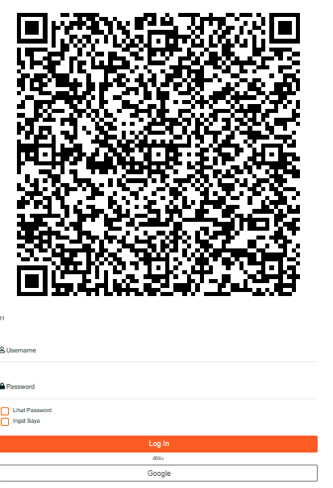
  
  ---------------------------------------------------------------------------------------------
  Gambar 2.2 Halaman Blok *Login*

  ---------------------------------------------------------------------------------------------

> Setelah *login* berhasil, maka Dosen Wali akan diarahkan ke halaman
> masing-masing untuk melaksanakan aktivitas pada DIAS.

3.  # Menanggapin Konsultasi Mahasiswa Perwalian

    1.  ## Perwalian Mahasiswa

> Pada blok **Mahasiswa** klik menu **Konsultasi Mahasiswa.**

  -----------------------------------------------------------------------------------------------
  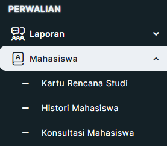

  -----------------------------------------------------------------------------------------------
  Gambar 3.1 Blok Menu Konsultasi Mahasiswa

  -----------------------------------------------------------------------------------------------

## Konsultasi Mahasiswa 
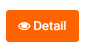

> Selanjutnya pada halaman Konsultasi Mahasiswa klik *button* *detail*
> untuk melihat *detail* Konsultasi Mahasiswa.

  ---------------------------------------------------------------------------------------------
  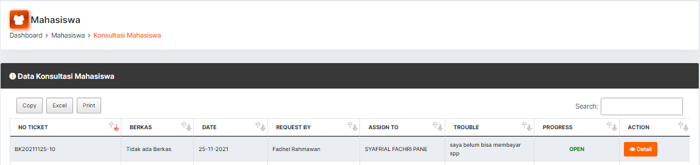

  ---------------------------------------------------------------------------------------------
Gambar 3.2 Data Konsultasi Mahasiswa

  ---------------------------------------------------------------------------------------------

> Pada halaman *detail* Konsultasi Mahasiswa selanjutnya klik *No
> Ticket* kemudian *button Action*
> 

  ---------------------------------------------------------------------------------------------
  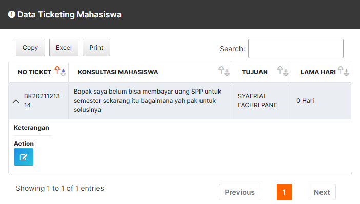
  
  ---------------------------------------------------------------------------------------------
Gambar 3.3 Data *Ticketing* Mahasiswa

  ---------------------------------------------------------------------------------------------

> Apabila permasalahan mahasiswa tidak bisa diatasi langsung oleh dosen
> wali maka dosen wali meneruskan pesan mahasiswa ke Ka Prodinya dengan
> mengisi halaman *Ticketing* jika sudah selesai klik *update* seperti
> pada gambar dibawah ini.

  ---------------------------------------------------------------------------------------------
  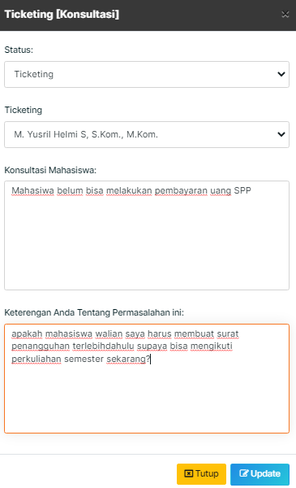
  
  ---------------------------------------------------------------------------------------------
Gambar 3.4 Halaman Pembahasan

  ---------------------------------------------------------------------------------------------

4.  # Upload Laporan Perwalian

    1.  ## Laporan Perwalian

> Pada blok perwalian klik menu **Laporan** kemudian klik Sub Menu
> **Laporan Perwalian**

-----------------------------------------------------------------------
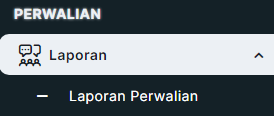                     

Gambar 4.1 Menu Laporan Perwalian    

-----------------------------------------------------------------------

Pada halaman laporan perwalian terdapat keterangan sebagai berikut :

-   Dokumen wajib di *upload* supaya diteruskan ke deputi.

-   Sebelum melakukan *[upload]{.underline}* lampiran, *download*
    > lampiran terlebih dahulu.

-   Jika pada berita penolakan terdapat notif \"tidak ada penolakan\"
    > abaikan saja dan jika terdapat penolakan harap *upload* ulang
    > berkas dan lampiran.

  ----------------------------------------------------------------------------------------------
  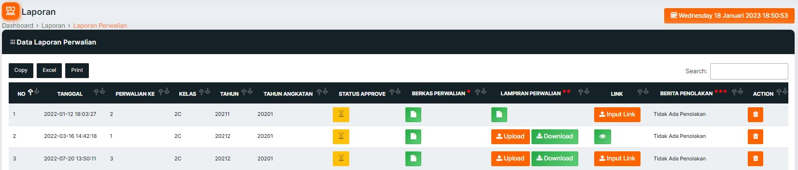
  
  ----------------------------------------------------------------------------------------------
  Gambar 4.2 Halaman Laporan

  ----------------------------------------------------------------------------------------------

1.  Silahkan klik button *Upload* Berkas Perwalian
    > 

  -----------------------------------------------------------------------------------------------
  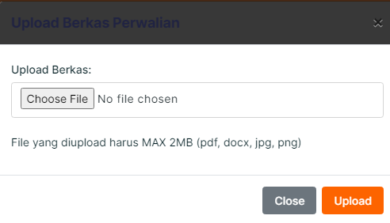
  
  -----------------------------------------------------------------------------------------------
 Gambar 4.3 *Upload* Berkas Perwalian

  -----------------------------------------------------------------------------------------------

> Laporan yang harus di *Upload* ini adalah hasil BAP laporan perwalian
> yang menggunakan WA *Group*, yang sudah iteung kirimkan melalui Email
> bapak/ibu yang terdaftar di SIP. Silahkan cek email bapak/ibu
> *download* filenya dan *Upload* di DIAS.

  ----------------------------------------------------------------------------------------------------------------------------------------
  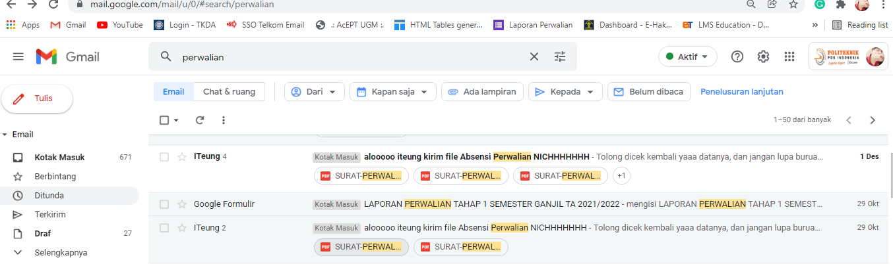
  
  ---------------------------------------------------------------------------------------------------- -----------------------------------
 Gambar 4.4 Berkas BAP Perwalian di Email oleh Iteung

  ----------------------------------------------------------------------------------------------------------------------------------------

2.  Silahkan klik *button* *download* lampiran terlebih dahulu Sebelum
    > melakukan *Upload* lampiran, pastikan lampiran ini sudah terisi,
    > jika kosong maka bapak/ibu dosen wali diminta untuk mengkonfirmasi
    > ke anak waliannya untuk menginputkan konsultasi. Seperti gambar
    > dibawah ini

  -----------------------------------------------------------------------------------------------------------------
  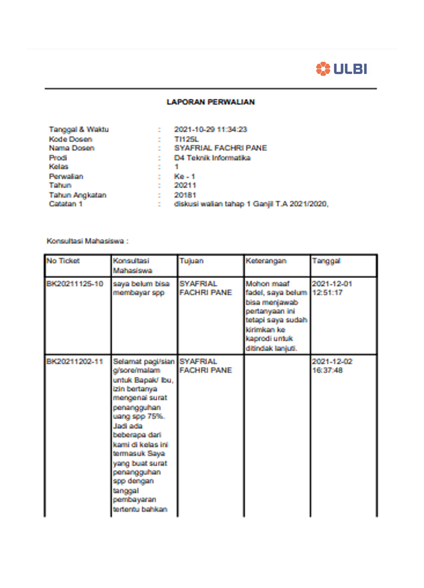
  
  -----------------------------------------------------------------------------------------------------------------
 Gambar 4.5 Dokumen Lampiran Konsultasi Perwalian

  -----------------------------------------------------------------------------------------------------------------

3.  Selanjutnya silahkan *Upload* lampiran yang telah di *Download*

  ----------------------------------------------------------------------------------------------
  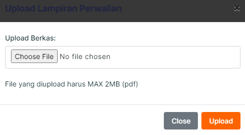
  
  ----------------------------------------------------------------------------------------------
 
 Gambar 4.6 *Upload* Lampiran Perwalian

  ----------------------------------------------------------------------------------------------

  ----------------------------------------------------------------------------------------------
  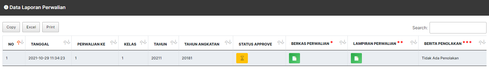
  
  ----------------------------------------------------------------------------------------------
  Gambar 4.7 Data Lampiran Perwalian

  ----------------------------------------------------------------------------------------------

> Jika laporan sudah selesai di *Upload* maka bapak ibu tinggal menunggu
> laporan perwalian di *approve* oleh Deputi Akademik.
>
> Jika pada berita penolakan terdapat notif \" tidak ada penolakan \"
> abaikan saja dan jika terdapat penolakan harap *Upload* ulang berkas
> dan lampiran.

  ----------------------------------------------------------------------------------------------
  
  
  ----------------------------------------------------------------------------------------------
  Gambar 4.8 Input Link

  ----------------------------------------------------------------------------------------------

> Pada data Laporan perwalian dosen selanjutnya menginputkan sebuah link
> rekaman atau dokumen lainnya sebagai bukti telah melakukan perwalian
> dengan terlebih dahulu disimpan di *google drive*, atau *youtube*
> kemudian link urlnya di copy dan di inputkan di laporan perwalian.

5.  #  Akademik

    1.  ##  Revisi Akademik

Pada halaman menu Akademik silahkan klik Revisi Akademik

  -----------------------------------------------------------------------------------------------
  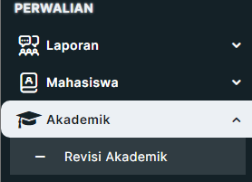
  
  -----------------------------------------------------------------------------------------------
  Gambar 5.1 Blok Menu Akademik

  -----------------------------------------------------------------------------------------------

Selanjutnya silahkan klik Revisi Akademik

  -----------------------------------------------------------------------------------------------
  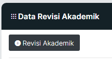
  
  -----------------------------------------------------------------------------------------------
  Gambar 5.2 Tambah Revisi Akademik

  -----------------------------------------------------------------------------------------------

> Pada halaman ini silahkan isi pengajuan revisi akademik kemudian klik
> simpan.

  ---------------------------------------------------------------------------------------------
  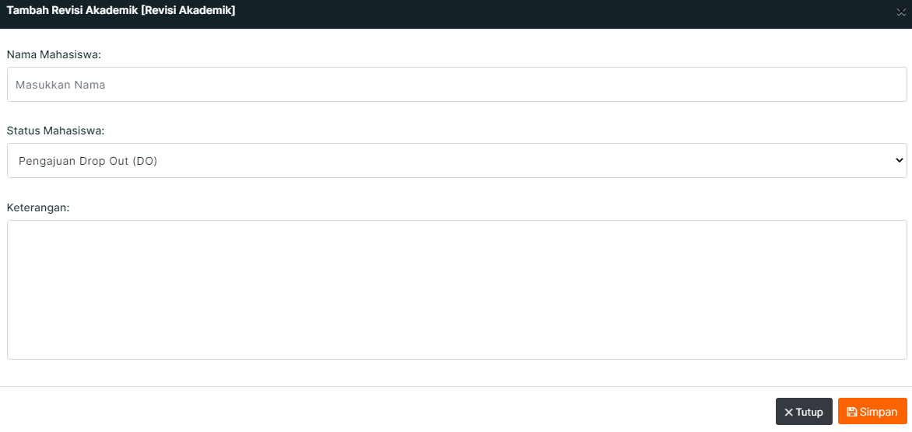
  
  ---------------------------------------------------------------------------------------------

Gambar 5.3 Halaman Isi Revisi Akademik

  ---------------------------------------------------------------------------------------------

> Jika dosen wali sudah mengajukan revisi akademik selanjutnya dosen
> wali tinggal menunggu jawaban dari Ka. Prodi seperti pada gambar di
> bawah

  ---------------------------------------------------------------------------------------------
  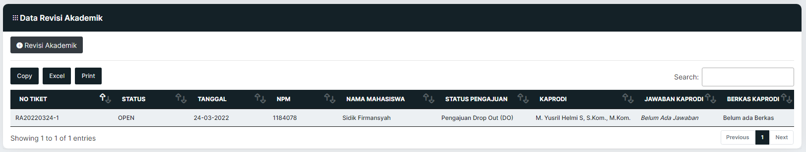
  
  ---------------------------------------------------------------------------------------------
 Gambar 5.4 Data Revisi Akademik

  ---------------------------------------------------------------------------------------------
