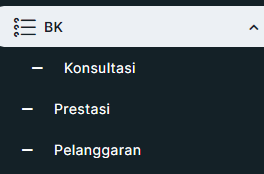
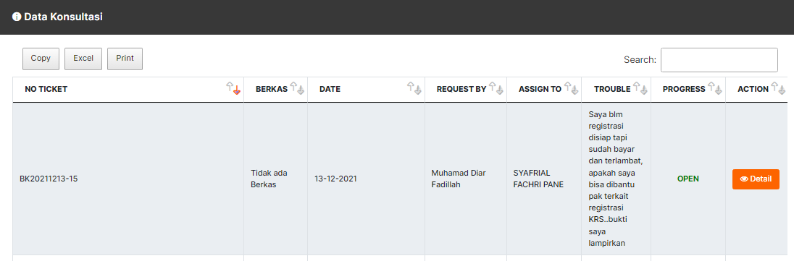
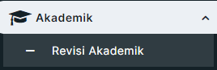
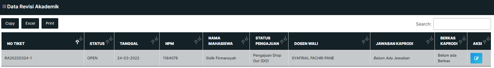
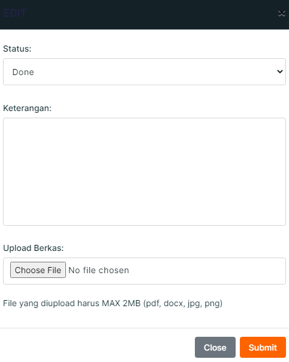

# **DAFTAR ISI** 

DAFTAR ISI [2](#daftar-isi)

DAFTAR GAMBAR [3](#daftar-gambar)

1. Halaman Login [4](#halaman-login)

1.1. Halaman Login [4](#halaman-login-1)

2. Perwalian [5](#perwalian)

2.1. Perwalian Mahasiswa [5](#_Toc100055154)

2.2. Konsultasi [5](#konsultasi)

3. Akademik [8](#akademik)](#akademik)

3.1. Revisi Akademik [8](#revisi-akademik)

# DAFTAR GAMBAR 

Gambar 1.1 Halaman Login Dias [4](#_Toc100055036)

Gambar 1.2 Halaman Blok Login [4](#_Toc100055037)

Gambar 2.1 Blok Menu Konsultasi [5](#_Toc100055038)

Gambar 2.2 Data Konsultasi [5](#_Toc100055039)

Gambar 2.3 Data Ticketing Mahasiswa

Gambar 2.4 Data Ticketing Done [6](#_Toc100055041)

Gambar 2.5 Halaman Pembahasan [7](#_Toc100055042)

Gambar 3.1 Menu Akademik [8](#_Toc100055043)

Gambar 3.2 Data Revisi Akademik [8](#_Toc100055044)

Gambar 3.3 Detail Aksi [8](#_Toc100055045)

## Halaman Login

> Untuk masuk ke halaman **DIAS** Ka Prodi dapat mengakses ke halaman
> utama [**https://dias.ulbi.ac.id/**](https://dias.ulbi.ac.id/)
  ---------------------------------------------------------------------------------------------
  

  ---------------------------------------------------------------------------------------------
Gambar 1.1 Halaman Login Dias

  ---------------------------------------------------------------------------------------------

Ka Prodi *login* terlebih dahulu dengan *username* dan *password* yang
telah ditentukan pada blok *login* yang berada disebelah kanan atas pada
halaman utama Dias.

  ---------------------------------------------------------------------------------------------
  
  
  ---------------------------------------------------------------------------------------------
Gambar 1.2 Halaman Blok Login

  ---------------------------------------------------------------------------------------------

Setelah *login* berhasil, maka Ka Prodi akan diarahkan ke halaman
masing-masing untuk melaksanakan aktivitas pada DIAS.

# Perwalian

1.  Perwalian Mahasiswa

Pada blok **BK** klik menu **Konsultasi.**

  ----------------------------------------------------------------------------------------------
  
  
  ----------------------------------------------------------------------------------------------
  Gambar 2.1 Blok Menu Konsultasi

  ----------------------------------------------------------------------------------------------

## Konsultasi 

> Pada halaman Konsultasi klik *button* *detail* untuk melihat *detail*
> Konsultasi Mahasiswa.
  --------------------------------------------------------------------------------------------
  
  
  --------------------------------------------------------------------------------------------
  Gambar 2.2 Data Konsultasi

  --------------------------------------------------------------------------------------------

> 
Pada halaman *detail* Konsultasi
> Mahasiswa selanjutnya klik *No* *Ticket* kemudian klik *button*
> *Action*
  ---------------------------------------------------------------------------------------------
  
  ---------------------------------------------------------------------------------------------
Gambar 2.3 Data *Ticketing* Mahasiswa

  ---------------------------------------------------------------------------------------------

> Apabila permasalahan mahasiswa dapat di selesaikan langsung oleh Ka
> Prodi maka pilih Status *Ticketing* Done kemudian isi keterangan
> tentang permasalahan ini, jika sudah selesai klik *button* *update*.
  ---------------------------------------------------------------------------------------------
  
  ---------------------------------------------------------------------------------------------
  Gambar 2.4 Data *Ticketing* *Done*

  ---------------------------------------------------------------------------------------------

> Selanjutnya apabila permasalahan mahasiswa tidak bisa diatasi langsung
> oleh Ka Prodi maka Ka Prodi dapat meneruskan pesan mahasiswa dengan
> memilih Status *Ticketing* ke Unit yang bersangkutan mengenai
> permasalahan mahasiswa ini.
  -----------------------------------------------------------------------------------------------
  
  
  -----------------------------------------------------------------------------------------------
  Gambar 2.5 Halaman Pembahasan

  -----------------------------------------------------------------------------------------------

# Akademik

2.  Revisi Akademik

Pada menu **Akademik** silahkan klik **Revisi Akademik.**

  ----------------------------------------------------------------------------------------------
  
  
  ----------------------------------------------------------------------------------------------
 Gambar 3.1 Menu Akademik

  ----------------------------------------------------------------------------------------------

Pada halaman Data Revisi Akademik silahkan klik pada menu aksi.

  ----------------------------------------------------------------------------------------------
  
  
  ----------------------------------------------------------------------------------------------
  Gambar 3.2 Data Revisi Akademik

  ----------------------------------------------------------------------------------------------

Selanjutnya pada halaman *detail* aksi silahkan isi **Status Mahasiswa**
dan **Keterangan** sesuai dari SK Direktur, kemudian *upload* Dokumen SK
tersebut, jika sudah lengkap klik ***Submit*.**
  ----------------------------------------------------------------------------------------------
  
  ----------------------------------------------------------------------------------------------
 Gambar 3.3 *Detail* Aksi
  ----------------------------------------------------------------------------------------------
