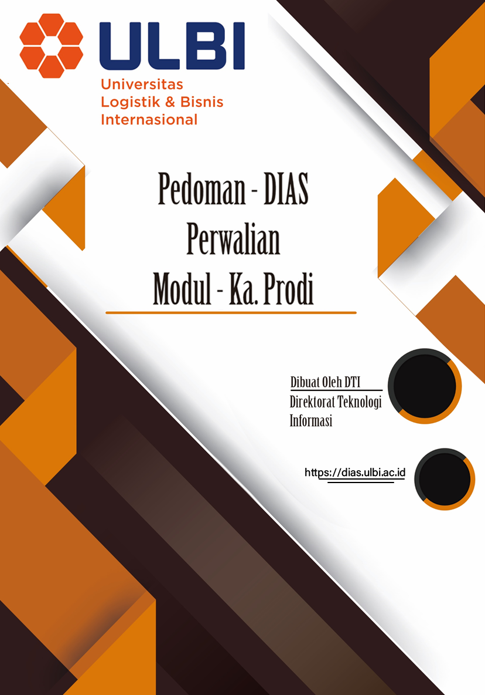

# **DAFTAR ISI** {#daftar-isi .TOC-Heading}

#  {#section .TOC-Heading}

[DAFTAR ISI [2](#daftar-isi)](#daftar-isi)

[DAFTAR GAMBAR [3](#daftar-gambar)](#daftar-gambar)

[1. Halaman Login [4](#halaman-login)](#halaman-login)

[1.1. Halaman Login [4](#halaman-login-1)](#halaman-login-1)

[2. Perwalian [5](#perwalian)](#perwalian)

[2.1. Perwalian Mahasiswa [5](#_Toc100055154)](#_Toc100055154)

[2.2. Konsultasi [5](#konsultasi)](#konsultasi)

[3. Akademik [8](#akademik)](#akademik)

[3.1. Revisi Akademik [8](#revisi-akademik)](#revisi-akademik)

# DAFTAR GAMBAR {#daftar-gambar .list-paragraph}

[Gambar 1.1 Halaman Login Dias [4](#_Toc100055036)](#_Toc100055036)

[Gambar 1.2 Halaman Blok Login [4](#_Toc100055037)](#_Toc100055037)

[Gambar 2.1 Blok Menu Konsultasi [5](#_Toc100055038)](#_Toc100055038)

[Gambar 2.2 Data Konsultasi [5](#_Toc100055039)](#_Toc100055039)

[Gambar 2.3 Data Ticketing Mahasiswa
[6](#_Toc100055040)](#_Toc100055040)

[Gambar 2.4 Data Ticketing Done [6](#_Toc100055041)](#_Toc100055041)

[Gambar 2.5 Halaman Pembahasan [7](#_Toc100055042)](#_Toc100055042)

[Gambar 3.1 Menu Akademik [8](#_Toc100055043)](#_Toc100055043)

[Gambar 3.2 Data Revisi Akademik [8](#_Toc100055044)](#_Toc100055044)

[Gambar 3.3 Detail Aksi [8](#_Toc100055045)](#_Toc100055045)

# Halaman Login

## Halaman Login

> Untuk masuk ke halaman **DIAS** Ka Prodi dapat mengakses ke halaman
> utama [**https://dias.ulbi.ac.id/**](https://dias.ulbi.ac.id/)

  ---------------------------------------------------------------------------------------------
  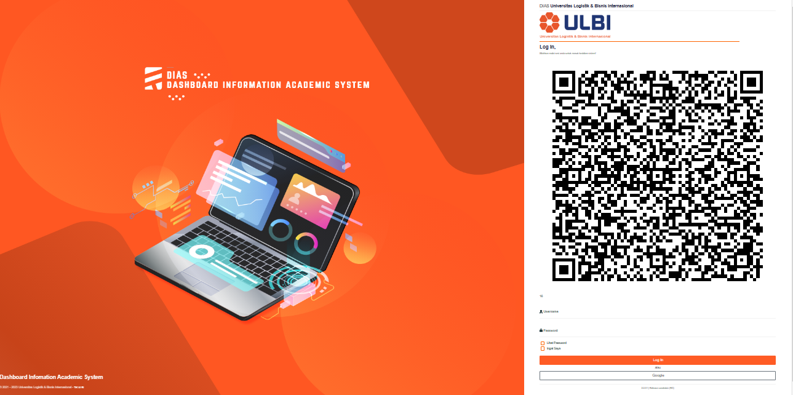{width="5.207784339457568in"
  height="2.594093394575678in"}
  ---------------------------------------------------------------------------------------------
  []{#_Toc100055036 .anchor}Gambar 1.1 Halaman Login Dias

  ---------------------------------------------------------------------------------------------

Ka Prodi *login* terlebih dahulu dengan *username* dan *password* yang
telah ditentukan pada blok *login* yang berada disebelah kanan atas pada
halaman utama Dias.

  ---------------------------------------------------------------------------------------------
  {width="2.153241469816273in"
  height="3.1271008311461066in"}
  ---------------------------------------------------------------------------------------------
  []{#_Toc100055037 .anchor}Gambar 1.2 Halaman Blok Login

  ---------------------------------------------------------------------------------------------

Setelah *login* berhasil, maka Ka Prodi akan diarahkan ke halaman
masing-masing untuk melaksanakan aktivitas pada DIAS.

# Perwalian

1.  

## Perwalian Mahasiswa

Pada blok **BK** klik menu **Konsultasi.**

  ----------------------------------------------------------------------------------------------
  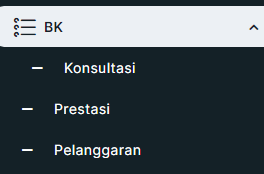{width="2.7503838582677167in"
  height="1.8127526246719161in"}
  ----------------------------------------------------------------------------------------------
  []{#_Toc100055038 .anchor}Gambar 2.1 Blok Menu Konsultasi

  ----------------------------------------------------------------------------------------------

##  {#section-1 .list-paragraph}

## 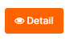{width="0.71875in" height="0.4125in"}Konsultasi 

> Pada halaman Konsultasi klik *button* *detail* untuk melihat *detail*
> Konsultasi Mahasiswa.

  --------------------------------------------------------------------------------------------
  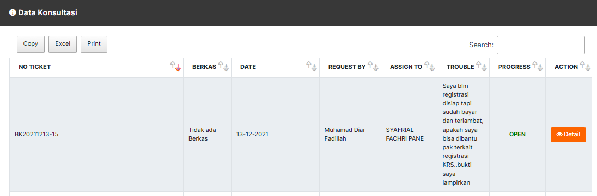{width="5.78740157480315in"
  height="1.9062642169728783in"}
  --------------------------------------------------------------------------------------------
  []{#_Toc100055039 .anchor}Gambar 2.2 Data Konsultasi

  --------------------------------------------------------------------------------------------

> 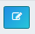{width="0.3416666666666667in"
> height="0.23584864391951005in"}Pada halaman *detail* Konsultasi
> Mahasiswa selanjutnya klik *No* *Ticket* kemudian klik *button*
> *Action*

  ---------------------------------------------------------------------------------------------
  {width="5.743628608923885in"
  height="3.3655643044619423in"}
  ---------------------------------------------------------------------------------------------
  []{#_Toc100055040 .anchor}Gambar 2.3 Data *Ticketing* Mahasiswa

  ---------------------------------------------------------------------------------------------

> Apabila permasalahan mahasiswa dapat di selesaikan langsung oleh Ka
> Prodi maka pilih Status *Ticketing* Done kemudian isi keterangan
> tentang permasalahan ini, jika sudah selesai klik *button* *update*.

  ---------------------------------------------------------------------------------------------
  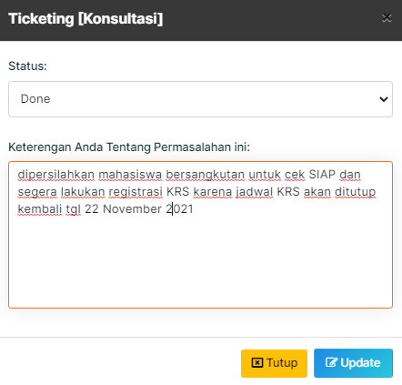{width="3.954884076990376in"
  height="3.784877515310586in"}
  ---------------------------------------------------------------------------------------------
  []{#_Toc100055041 .anchor}Gambar 2.4 Data *Ticketing* *Done*

  ---------------------------------------------------------------------------------------------

> Selanjutnya apabila permasalahan mahasiswa tidak bisa diatasi langsung
> oleh Ka Prodi maka Ka Prodi dapat meneruskan pesan mahasiswa dengan
> memilih Status *Ticketing* ke Unit yang bersangkutan mengenai
> permasalahan mahasiswa ini.

  -----------------------------------------------------------------------------------------------
  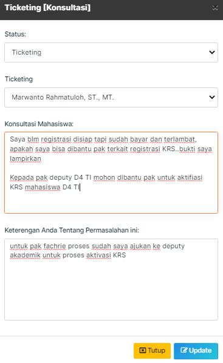{width="3.8229166666666665in"
  height="6.229166666666667in"}
  -----------------------------------------------------------------------------------------------
  []{#_Toc100055042 .anchor}Gambar 2.5 Halaman Pembahasan

  -----------------------------------------------------------------------------------------------

# Akademik

2.  

##  Revisi Akademik

Pada menu **Akademik** silahkan klik **Revisi Akademik.**

  ----------------------------------------------------------------------------------------------
  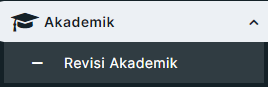{width="2.792055993000875in"
  height="0.9063768591426071in"}
  ----------------------------------------------------------------------------------------------
  []{#_Toc100055043 .anchor}Gambar 3.1 Menu Akademik

  ----------------------------------------------------------------------------------------------

Pada halaman Data Revisi Akademik silahkan klik pada menu aksi.

  ----------------------------------------------------------------------------------------------
  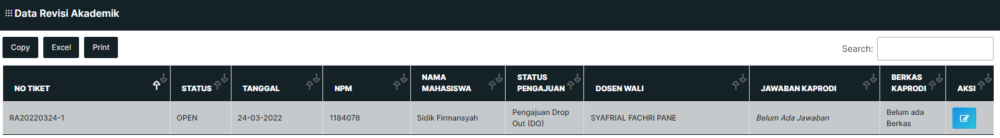{width="5.817623578302713in"
  height="0.8063210848643919in"}
  ----------------------------------------------------------------------------------------------
  []{#_Toc100055044 .anchor}Gambar 3.2 Data Revisi Akademik

  ----------------------------------------------------------------------------------------------

Selanjutnya pada halaman *detail* aksi silahkan isi **Status Mahasiswa**
dan **Keterangan** sesuai dari SK Direktur, kemudian *upload* Dokumen SK
tersebut, jika sudah lengkap klik ***Submit*.**

  ----------------------------------------------------------------------------------------------
  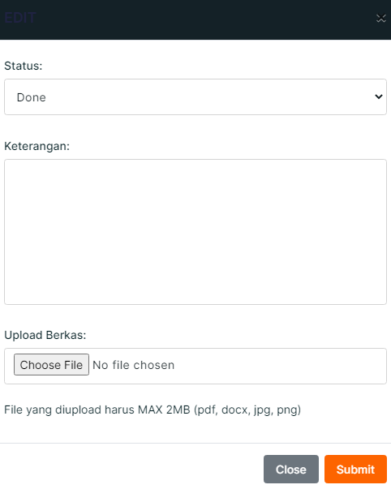{width="2.497787620297463in"
  height="3.1248239282589676in"}
  ----------------------------------------------------------------------------------------------
  []{#_Toc100055045 .anchor}Gambar 3.3 *Detail* Aksi

  ----------------------------------------------------------------------------------------------
