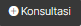

{width="9.541666666666666in"
height="12.85275043744532in"}

[]{#_heading=h.gjdgxs .anchor}**DAFTAR ISI**

[DAFTAR ISI 2](#_heading=h.gjdgxs)

[DAFTAR GAMBAR 3](#daftar-gambar)

[A.](#login) Login 4

> [1.](#halaman-login) Halaman Login 4

[B.](#perwalian) Perwalian 5

> [1.](#halaman-konsultasi) Halaman Konsultasi 5

# DAFTAR GAMBAR

[Gambar A.1 Halaman Login Dias 4](#_heading=h.2et92p0)

[Gambar A.2 Halaman Blok Login 4](#_heading=h.tyjcwt)

[Gambar A.3 Halaman Aktivitas Mahasiswa 5](#_heading=h.3dy6vkm)

[Gambar B.1 Menu BK 5](#_heading=h.2s8eyo1)

[Gambar B.2 Halaman konsultasi 5](#_heading=h.17dp8vu)

[Gambar B.3 Halaman Pembahasan 6](#_heading=h.26in1rg)

[Gambar B.4 Halaman Progres Open Data Konsultasi 6](#_heading=h.lnxbz9)

[Gambar B.5 Halaman Progres Done Data Konsultasi 7](#_heading=h.35nkun2)

[Gambar B.6 Data Ticketing Mahasiswa 7](#_heading=h.1ksv4uv)

#  Login

## Halaman *Login*

> Untuk masuk ke halaman **DIAS**, Mahasiswa dapat mengakses ke halaman
> utama
> [**[https://dias.ulbi.ac.id/]{.underline}**](https://dias.ulbi.ac.id/)

+-----------------------------------------------------------------------+
| {width="5.207784339457568in" |
| height="2.594093394575678in"}                                         |
+=======================================================================+
| Gambar A.1 Halaman Login DIAS                                         |
|                                                                       |
| []{#_heading=h.2et92p0 .anchor}                                       |
+-----------------------------------------------------------------------+

> Mahasiswa *login* terlebih dahulu dengan *username* dan *password*
> yang telah ditentukan, pada blok *login* yang berada disebelah kanan
> pada halaman utama Dias, **gunakan *username* dan *password* anda yang
> terdaftar disistem akademik (SIP).**

  ----------------------------------------------------------------------------------------------
  {width="2.0706714785651794in"
  height="3.03330927384077in"}
  ----------------------------------------------------------------------------------------------
  []{#_heading=h.tyjcwt .anchor}Gambar A.2 Halaman Blok *Login*

  ----------------------------------------------------------------------------------------------

> Setelah *login* berhasil, maka mahasiswa akan diarahkan ke halaman
> dashboard mahasiswa masing-masing.

  ---------------------------------------------------------------------------------------------
  {width="5.252777777777778in"
  height="2.5243055555555554in"}
  ---------------------------------------------------------------------------------------------
  []{#_heading=h.3dy6vkm .anchor}Gambar A.3 Halaman Aktivitas Mahasiswa

  ---------------------------------------------------------------------------------------------

#  Perwalian

## Halaman Konsultasi 

> Untuk melakukan proses perwalian, mahasiswa dapat meng-klik pada blok
> **BK** kemudian klik menu **Konsultasi,** seperti gambar dibawah ini.

  -----------------------------------------------------------------------------------------------
  {width="1.9852187226596676in"
  height="1.6939096675415573in"}
  -----------------------------------------------------------------------------------------------
  []{#_heading=h.2s8eyo1 .anchor}Gambar B.1 Menu P3

  -----------------------------------------------------------------------------------------------

  ----------------------------------------------------------------------------------------------
  {width="5.252777777777778in"
  height="1.0194444444444444in"}
  ----------------------------------------------------------------------------------------------
  []{#_heading=h.17dp8vu .anchor}Gambar B.2 Halaman konsultasi

  ----------------------------------------------------------------------------------------------

Selanjutnya klik button
{width="0.7417224409448819in"
height="0.23808398950131235in"} seperti pada gambar diatas.

  ----------------------------------------------------------------------------------------------
  {width="5.222222222222222in"
  height="3.004861111111111in"}
  ----------------------------------------------------------------------------------------------
  []{#_heading=h.26in1rg .anchor}Gambar B.3 Halaman Pembahasan

  ----------------------------------------------------------------------------------------------

> Selanjutnya mahasiswa dapat memilih kategori apa yang ingin diajukan,
> contoh Disini akan mengajukan permasalahaan Akademik, mahasiswa dapat
> memilih kategori Akademik selanjutnya isi pembahasanya sesuai
> permasalahan mahasiswa masing-masing, jika ada file yang perlu di
> *upload* mahasiswa tinggal klik ***Choose File***, kemudian jika sudah
> merasa benar klik *button* simpan.

  ---------------------------------------------------------------------------------------------
  {width="5.231274059492564in"
  height="1.814090113735783in"}
  ---------------------------------------------------------------------------------------------
  []{#_heading=h.lnxbz9 .anchor}Gambar B.4 Halaman *Progress* *Open* Data Konsultasi

  ---------------------------------------------------------------------------------------------

> Setelah melakukan pengisian perwalian maka status ***PROGRES OPEN***,
> selanjutnya mahasiswa tinggal menunggu proses dari dosen wali masing
> -- masing dan unit yang bersangkutan.
>
> Apabila status ***PROGRES DONE*** itu artinya permasalahan mahasiswa
> sudah selesai, klik *button Detail* untuk dapat melihat jawaban dari
> dosen wali dan unit yang bersangkutan

+-----------------------------------------------------------------------+
| {width="5.228197725284339in" |
| height="1.9501224846894138in"}                                        |
+=======================================================================+
| []{#_heading=h.35nkun2 .anchor}Gambar B.5 Halaman *Progress* *Done*   |
| Data Konsultasi                                                       |
+-----------------------------------------------------------------------+
| {width="5.232622484689414in" |
| height="3.3048468941382327in"}                                        |
+-----------------------------------------------------------------------+
| []{#_heading=h.1ksv4uv .anchor}Gambar B.6 Data *Ticketing* Mahasiswa  |
+-----------------------------------------------------------------------+

> Selanjutnya langkah terakhir silahkan mahasiswa melaksanakan perintah
> yang telah di berikan pada halaman Data *Ticketing* Mahasiswa.
