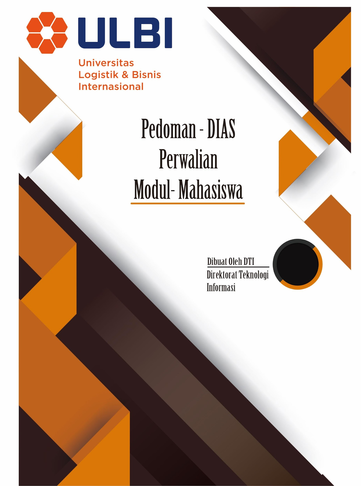
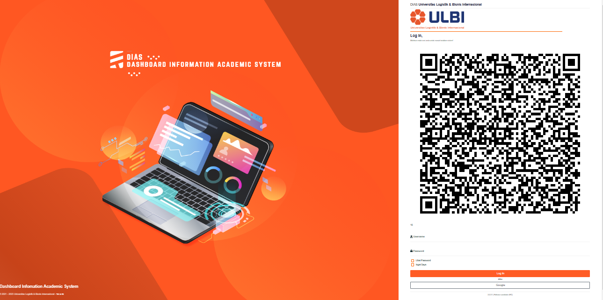
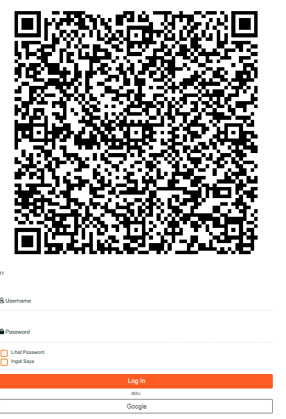
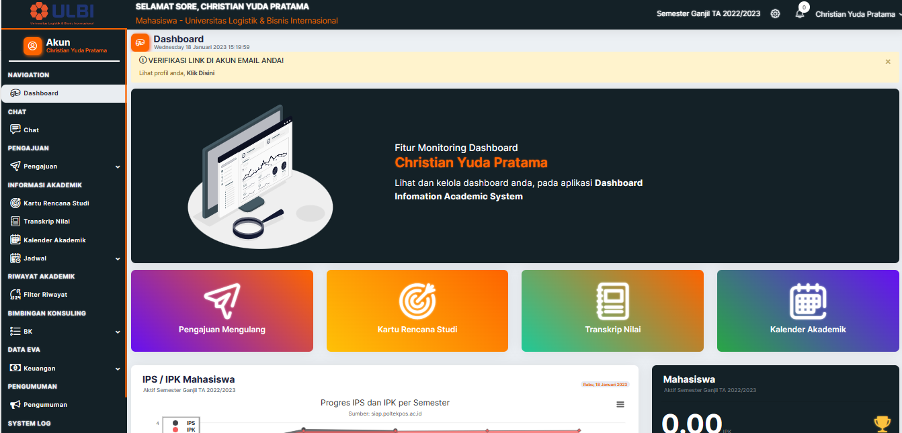
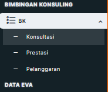
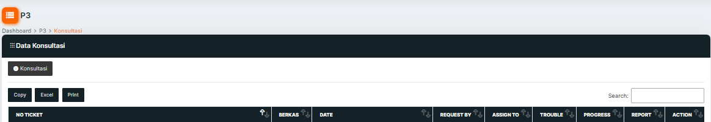
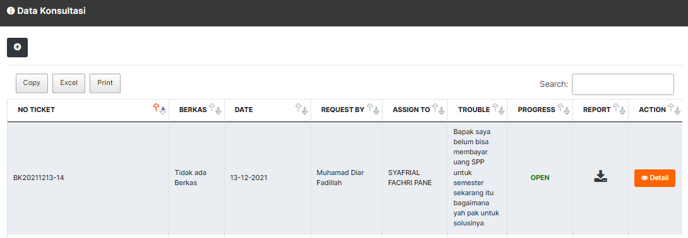
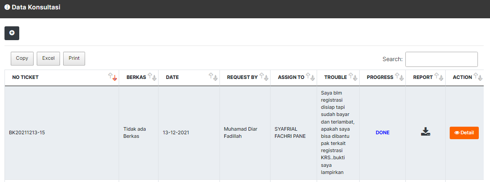
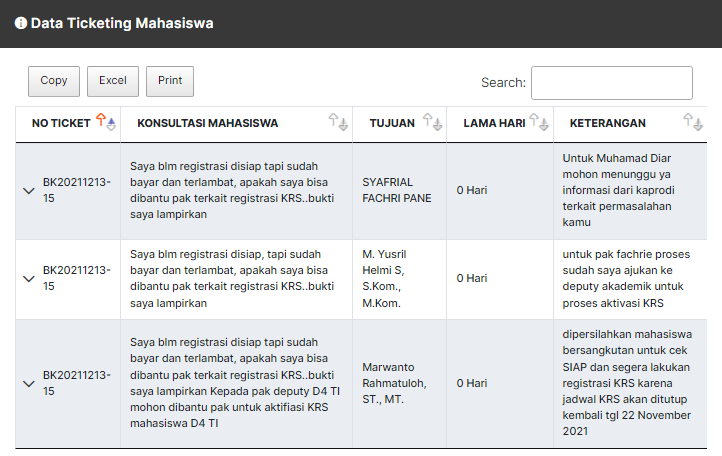

**DAFTAR ISI**

[DAFTAR ISI 2](#_heading=h.gjdgxs)

[DAFTAR GAMBAR 3](#daftar-gambar)

[A.](#login) Login 4

> [1.1](#halaman-login) Halaman Login 4

[B.](#perwalian) Perwalian 5

> [1.2](#halaman-konsultasi) Halaman Konsultasi 5

# DAFTAR GAMBAR

[Gambar A.1 Halaman Login Dias 4](#_heading=h.2et92p0)

[Gambar A.2 Halaman Blok Login 4](#_heading=h.tyjcwt)

[Gambar A.3 Halaman Aktivitas Mahasiswa 5](#_heading=h.3dy6vkm)

[Gambar B.1 Menu BK 5](#_heading=h.2s8eyo1)

[Gambar B.2 Halaman konsultasi 5](#_heading=h.17dp8vu)

[Gambar B.3 Halaman Pembahasan 6](#_heading=h.26in1rg)

[Gambar B.4 Halaman Progres Open Data Konsultasi 6](#_heading=h.lnxbz9)

[Gambar B.5 Halaman Progres Done Data Konsultasi 7](#_heading=h.35nkun2)

[Gambar B.6 Data Ticketing Mahasiswa 7](#_heading=h.1ksv4uv)

#  Login

## Halaman *Login*

> Untuk masuk ke halaman **DIAS**, Mahasiswa dapat mengakses ke halaman
> utama
> [https://dias.ulbi.ac.id/](https://dias.ulbi.ac.id/)

-----------------------------------------------------------------------
 

| Gambar A.1 Halaman Login DIAS |

-----------------------------------------------------------------------

> Mahasiswa *login* terlebih dahulu dengan *username* dan *password*
> yang telah ditentukan, pada blok *login* yang berada disebelah kanan
> pada halaman utama Dias, **gunakan *username* dan *password* anda yang
> terdaftar disistem akademik (SIP).**

  ----------------------------------------------------------------------------------------------
  

  Gambar A.2 Halaman Blok *Login*

  ----------------------------------------------------------------------------------------------

> Setelah *login* berhasil, maka mahasiswa akan diarahkan ke halaman
> dashboard mahasiswa masing-masing.

  ---------------------------------------------------------------------------------------------
  

 ----------------------------------------------------------------------------------------------
Gambar A.3 Halaman Aktivitas Mahasiswa

  ---------------------------------------------------------------------------------------------

#  Perwalian

## Halaman Konsultasi 

> Untuk melakukan proses perwalian, mahasiswa dapat meng-klik pada blok
> **BK** kemudian klik menu **Konsultasi,** seperti gambar dibawah ini.

  -----------------------------------------------------------------------------------------------
  
  
  ----------------------------------------------------------------------------------------------
 Gambar B.1 Menu P3

  -----------------------------------------------------------------------------------------------

  ----------------------------------------------------------------------------------------------
  

Gambar B.2 Halaman konsultasi

  ----------------------------------------------------------------------------------------------

Selanjutnya klik button

seperti pada gambar diatas.

  ----------------------------------------------------------------------------------------------
  
  
  ----------------------------------------------------------------------------------------------
Gambar B.3 Halaman Pembahasan

  ----------------------------------------------------------------------------------------------

> Selanjutnya mahasiswa dapat memilih kategori apa yang ingin diajukan,
> contoh Disini akan mengajukan permasalahaan Akademik, mahasiswa dapat
> memilih kategori Akademik selanjutnya isi pembahasanya sesuai
> permasalahan mahasiswa masing-masing, jika ada file yang perlu di
> *upload* mahasiswa tinggal klik ***Choose File***, kemudian jika sudah
> merasa benar klik *button* simpan.

  ---------------------------------------------------------------------------------------------
  
  
  ---------------------------------------------------------------------------------------------
Gambar B.4 Halaman *Progress* *Open* Data Konsultasi

  ---------------------------------------------------------------------------------------------

> Setelah melakukan pengisian perwalian maka status ***PROGRES OPEN***,
> selanjutnya mahasiswa tinggal menunggu proses dari dosen wali masing
> -- masing dan unit yang bersangkutan.
>
> Apabila status ***PROGRES DONE*** itu artinya permasalahan mahasiswa
> sudah selesai, klik *button Detail* untuk dapat melihat jawaban dari
> dosen wali dan unit yang bersangkutan

-----------------------------------------------------------------------
 

Gambar B.5 Halaman *Progress* *Done*  Data Konsultasi      

-----------------------------------------------------------------------
    
