> *DAFTAR ISI*
> [Bagian 1 Instalasi dan Login 4](#bagian-1-instalasi-dan-login)
> 1 [Instalasi 4](#instalasi)
> 2 [Halaman Login 5](#halaman-login)
> [Bagian 2 5](#bagian-2)
> [2.1 Halaman Pendaftaran 5](#halaman-pendaftaran)
> [Bagian 3 8](#bagian-3)
> [3.1 Pembayaran POSPAY 8](#pembayaran-pospay)

> **DAFTAR GAMBAR**
>
> [Gambar 1 Pengunduhan dan instalasi pospay 4](#bookmark2)
>
> [Gambar 2 Loading Screen 4](#_bookmark3)
>
> [Gambar 3 Halaman Login 5](#_bookmark5)
>
> [Gambar 4 Halaman Pendaftaran 5](#_bookmark8)
>
> [Gambar 5 Pengaktifan Lokasi 6](#_bookmark9)
>
> [Gambar 6 Verifikasi OT 6](#_bookmark10)
>
> [Gambar 7 Pengisian Username dan Password 7](#_bookmark11)
>
> [Gambar 8 Aktivasi Rekening Giro 7](#_bookmark12)
>
> [Gambar 9 Rekening Berhasil Dibuat 8](#_bookmark13)
>
> [Gambar 10 Dashboard POSYPAY 8](#_bookmark16)
>
> [Gambar 11 Input Jenis Pembayaran dan Nomor Pelanggan 9](#_bookmark17)
>
> [Gambar 12 Verifikasi iteung Cek Biodata dan Va Mahasiswa
> 9](#_bookmark18)
>
> [Gambar 13 Konfirmasi Transaksi 10](#_bookmark19)
>
> [Gambar 14 Gagal Melakukan Pembayaran 10](#_bookmark20)
>
> [Gambar 15 Transaksi Berhasil dan Mengunggah Hasil Transaksi
> 11](#_bookmark21)
# Bagian 1 Instalasi dan Login

1.  ## Instalasi

    1.  Untuk masuk kehalaman POSPAY mahasiswa dapat mengunduh terlebih
        dahulu diplaystore dengan mengetikkan POSPAY, dan pastikan
        proses instalasi berjalan dengan baik.
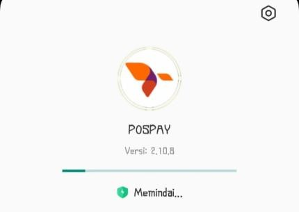
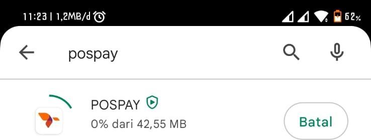

  Gambar 1 Pengunduhan dan instalasi pospay

2.   Setelah berhasil mengunduh dan menginstal POSPAY anda akan diarahkan pada loading screen dan akan masuk kehalaman login

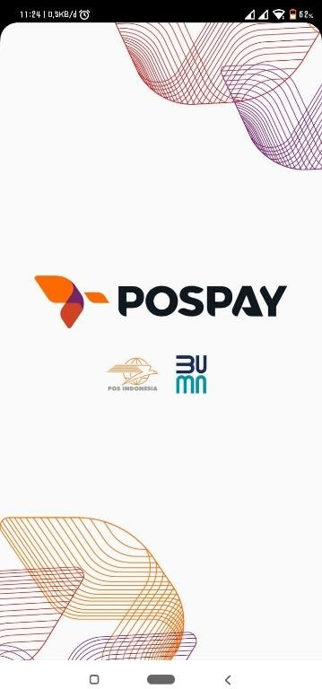

> Gambar 2 Loading Screen
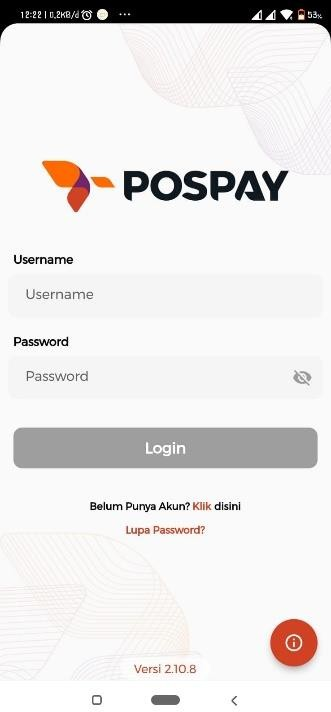
Halaman Login

Gambar 3 Halaman Login

 Mahasiswa akan diminta login terlebih dahulu dengan username dan password yang sudah ditentukan. Jika anda belum mempunyai akun silahkan untuk mendaftarkan diri terlebih dahulu dengan menekan klik disini.

 Bagian 2

2.1 Halaman Pendaftaran

 Pada proses daftar anda akan diminta untuk mengisi data diri berupa nama lengkap, no handphone dan email,silahkan masukan jika anda memiliki kode referral tertentu.

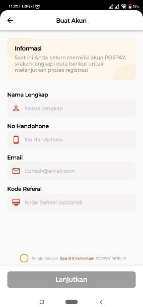

> Gambar 4 Halaman Pendaftaran
2)  Jika mengalami kendala saat mengisi form pendaftaran, anda bisa
    mengaktifkan lokasi anda terlebih dahulu.

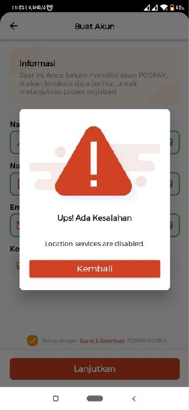
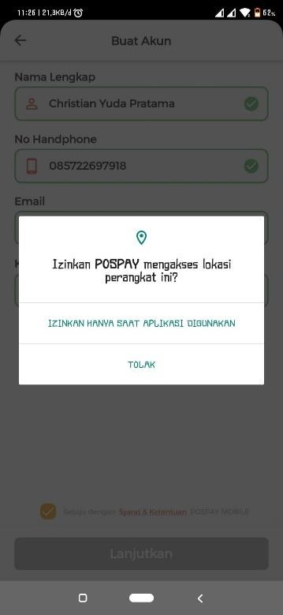

> Gambar 5 Pengaktifan Lokasi
3)  Setelah pengguna melakukan pengisian form, untuk dikonfirmasikan no
    telepon yang sesuai dengan pengisian form maka akan diminta kode otp
    yang akan dikirimkan ke nomor handphone

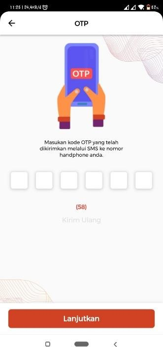

> Gambar 6 Verifikasi OT
4)  Pendaftaran selesai, pengguna akan diminta memilih username dan
    password yang akan ditentukan,username dan password inilah yang akan
    menjadi akses POSPAY.

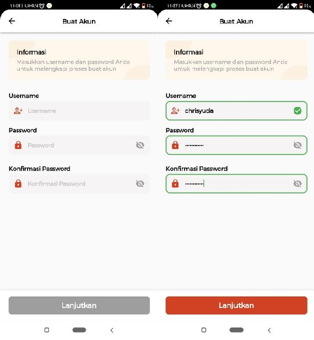

> Gambar 7 Pengisian Username dan Password
5)  Kemudian anda akan langsung masuk pada bagian berikut HALAMAN
    AKTIVASI REKENING GIRO, silahkan untuk tekan buka rekening, dan
    kemudian anda akan diminta memasukkan pin yang akan ditentukan, pin
    ini akan digunakan saat melakukan pembayaran apapun menggunakan
    POSPAY.

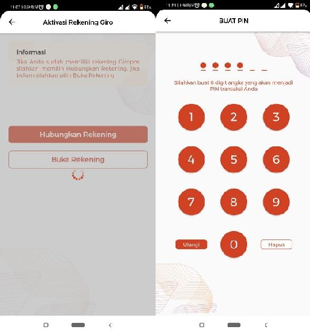

> Gambar 8 Aktivasi Rekening Giro
6)  Proses Pendaftaran telah selesai, silahkan kembali kehalaman login
    dan memasukkan username dan password yang sudah ditentukan.

> 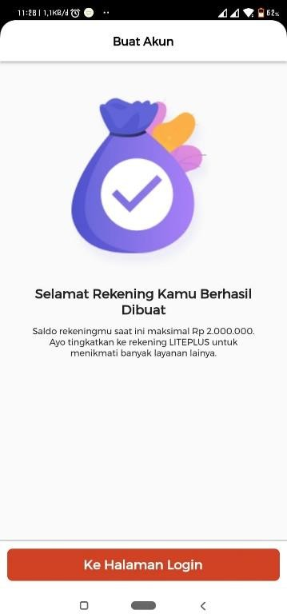

> *Gambar 9 Rekening Berhasil Dibuat*
# Bagian 3

## 3.1 Pembayaran POSPAY

1)  Setelah melalui proses pendaftaran , maka untuk proses selanjutnya
    adalah melakukan pengisian saldo terlebih dahulu sesuai dengan
    tagihan yang akan dibayarkan.silahkan untuk menekan menu ,kemudian
    pilih menu ULBI

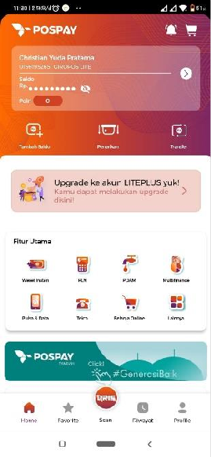
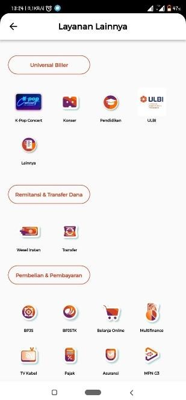

> Gambar 10 Dashboard POSYPAY
2)  Selanjutnya pada field Pilih Jenis Pembayaran silahkan untuk memilih
    'Pembayaran ULBI' dan pada field nomor pelanggan dapat diisi dengan
    kode transaksi pospay terbaru, pengguna dapat menemukan kode
    transaksi dengan melakukan chat pada iteung dengan mengetikkan
    keyword '**iteung minta biodata dan va mahasiswa**. Kemudian dapat
    dimasukkan kode POSPAY dinomor pelanggan.

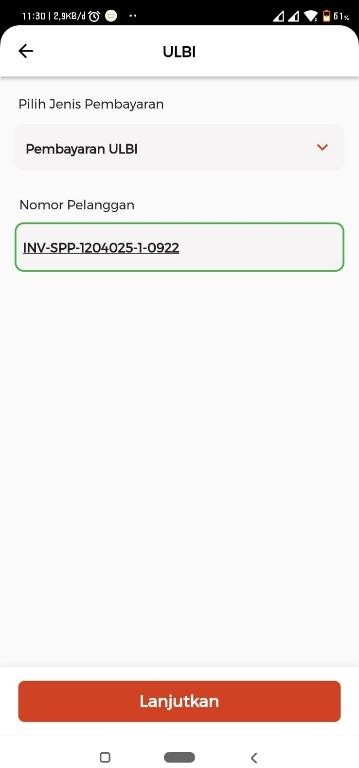

> Gambar 11 Input Jenis Pembayaran dan Nomor Pelanggan
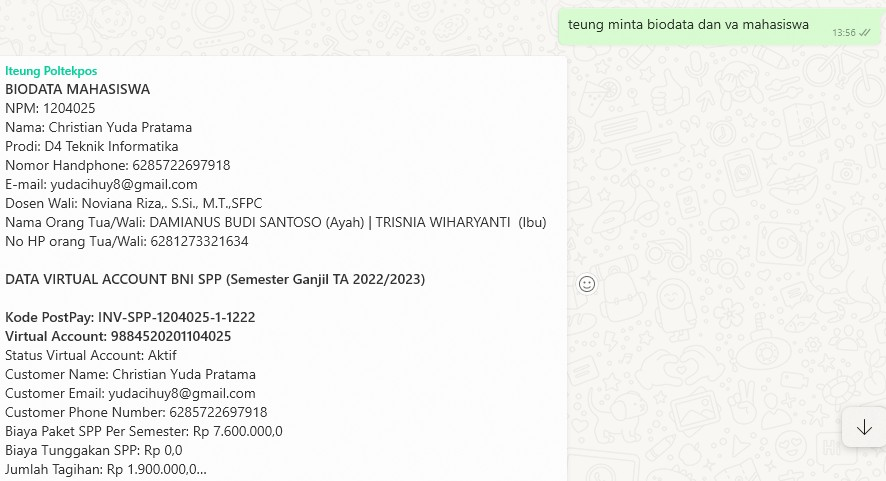

> Gambar 12 Verifikasi iteung Cek Biodata dan Va Mahasiswa
3)  Maka akan tampil berapa jumlah total yang harus dibayarkan, Adapun
    minimal pembayaran yaitu setengah dari total tagihan pembayaran.

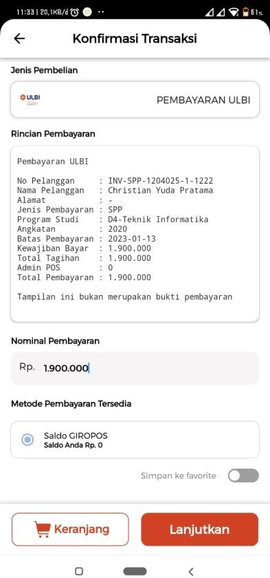

> Gambar 13 Konfirmasi Transaksi
4)  Jika anda tidak membayar setengah dari total biaya tagihan tersebut
    maka akan memunculkan sebuah pop up berikut.

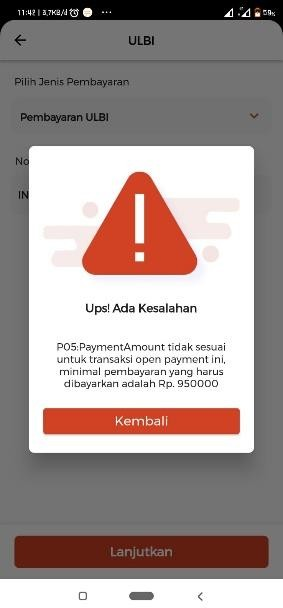

>*Gambar 14 Gagal Melakukan Pembayaran*
5)  Setelah pembayaran selesai maka akan memunculkan hasil transaksi
    sukses, dan anda dapat mengunduh hasil transaksi yang telah
    dibayarkan

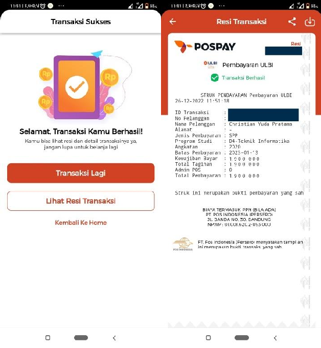

> Gambar 15 Transaksi Berhasil dan Mengunggah Hasil Transaksi
